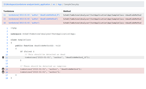

scheb/tombstone-analyzer
========================

**Please note, that tombstone-analyzer is currently being reworked and versions >= 0.4.0 are very unstable. If you want
to use it, use 0.3.0 or wait until there's a 1.0.0** 

[](https://travis-ci.org/scheb/tombstone-analyzer)
[](https://scrutinizer-ci.com/g/scheb/tombstone-analyzer/?branch=master)
[](https://scrutinizer-ci.com/g/scheb/tombstone-analyzer/?branch=master)
[](https://packagist.org/packages/scheb/tombstone-analyzer)
[](https://packagist.org/packages/scheb/tombstone-analyzer)
[](https://packagist.org/packages/scheb/tombstone-analyzer)

**Report generation** for the tombstones created with the [scheb/tombstone](https://github.com/scheb/tombstone) library.

[](doc/dashboard.png) [](doc/code.png)

Installation
------------

Install via composer

```bash
$ composer require scheb/tombstone-analyzer
```

Composer automatically creates an executable binary `vendor/bin/tombstone-analyzer`.

Usage
-----

Provide a YAML config file to the tombstone-analyzer. Providing the config file is optional, by default it looks for a
file named `tombstone.yml` in the current working directory.

```bash
$ tombstone-analyzer -c tombstone.yml
```

Configuration
-------------

Relative paths in the configuration file are resolved relative to the config file's location.

The tool uses [symfony/finder](https://symfony.com/doc/current/components/finder.html) to scan the source directory, so
have a look at its documentation to understand filter options.

Minimum configuration:

```yaml
source:
    directories:
        - src  
logs:
    directory: logs

rootDir: root
```

All configuration options:

```yaml
source:
    # Required, Where your source files are located (see finder's "in" option)
    directories:
        - src

    # Exclude patterns relative to the ones defined in "directories" (see finder's "exclude" option)
    excludes:
        - tests

    # Name pattern to be included (see finder's "name" option)
    names:
        - "*.php"

    # Name pattern to be excluded (see finder's "notName" option)
    notNames:
        - "*.js"

# Optional, the root directory is used to make paths from the scanned sources relative. This is important, if you made
# the paths in your logs relative to a root directory.
rootDir: root

# One of the logs providers must be set, either "directory" or "custom"
logs:

    # Use the log file provider. This is where log files from AnalyzerLogHandler are located.
    directory: logs
    
    # Use your own log provider. You have to configure the file and class name.
    # Has to implement Scheb\Tombstone\Analyzer\Log\LogReaderInterface
    custom:
        file: "srLogReaderInterfaceder.php"
        class: 'Scheb\Tombstone\Analyzer\TestApplication\Tombstone\LogProvider'

# Report generation options
report:
    php: report/tombstone-report.php  # Generate a PHP report dump here
    html: report   # Generate a HTML report here
    console: true  # Display report on the console (default: false)
```

Contribute
----------
You're welcome to [contribute](https://github.com/scheb/tombstone-analyzer/graphs/contributors) to this library by
creating a pull requests or feature request in the issues section. For pull requests, please follow these guidelines:

- Symfony code style
- PHP7.1 type hints for everything (including: return types, `void`, nullable types)
- `declare(strict_types=1)` must be used
- Please add/update test cases
- Test methods should be named `[method]_[scenario]_[expected result]`

To run the test suite install the dependencies with `composer install` and then execute `bin/phpunit`.

Acknowledgments
---------------

The library is heavly inspired by
[Nestoria.com's implementation](http://devblog.nestoria.com/post/115930183873/tombstones-for-dead-code)
of the tombstone concept.

Thanks to [Sebastian Bergmann](https://github.com/sebastianbergmann) for letting me re-use parts of his code and the
template files.

License
-------
This library is available under the [MIT license](LICENSE).
