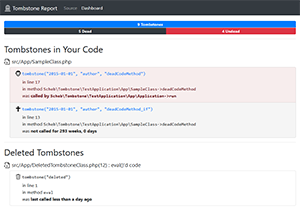
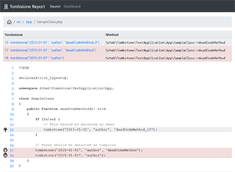

Report Formats
==============

Checkstyle
----------

Generate a Checkstyle XML report, which can be used with many popular code quality and CI tools. The Checkstyle result
will contain all dead tombstones (aka "vampires") with an error-level message.

```yaml
report:
    checkstyle: report/checkstyle.xml  # Generate a Checkstyle report in this file
```

HTML
----

Generates a human-readable HTML report. Includes a dashboard, the ability to browse the source tree and displays
tombstones with their status (dead/undead) in the source code.

[](dashboard.png) [](code.png)

```yaml
report:
    html: report   # Generate a HTML report in this folder
```

Console
-------

Prints the result on the command line. Not recommended for large codebases with many tombstones since it will print a
lot of text on your screen.

```yaml
report:
    console: true  # Display report on the console (default: false)
```

PHP
---

The PHP report simply dumps the data structure with the analyzer result into a PHP file.

```yaml
report:
    php: report/tombstone-report.php   # Generate a PHP dump of the result in this file
```
